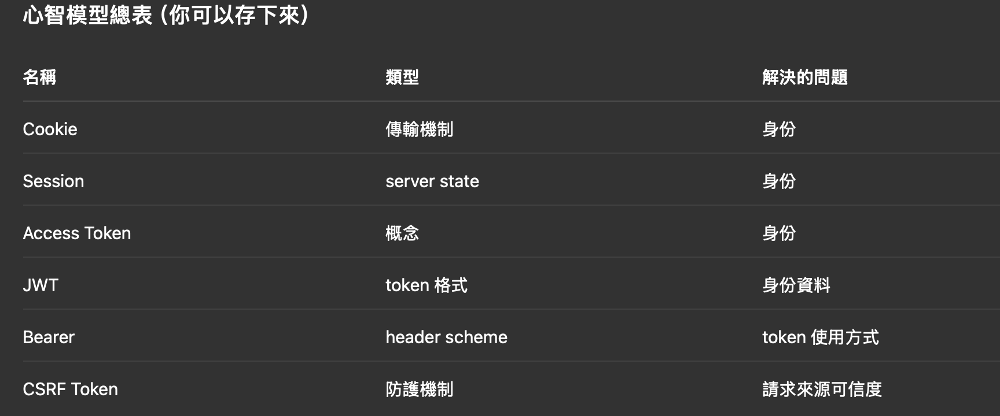

# 開發紀錄

## 20251213

### 建立 footer store

- 使用`createSelector`來避免不必要的[重新渲染]問題

### API 方法

1.  getCookie方法與意義：
    - 當我送出 POST / PUT / PATCH / DELETE 這類會改資料的請求時，我要把後端存在 Cookie 裡的 CSRF token，拿出來放進 request header。

**Extra**：

- 遇到erasableSyntaxOnly問題 => TypeScript 只能用「不需要轉換成 JS」的語法
- 為什麼要獨立 ApiError 檔案？ => 架構層面的原因

```javascript=1
### 現在的 API 設計是：

    HTTP client
        ↓
    normalFetch
        ↓
Redux thunk / selector
        ↓
        UI
```

- CSRF 整理：
  - 那 CSRF token 到底是什麼？
    - 有沒有拿到我發給我自己網站的祕密紙條
    - CSRF = 防止「瀏覽器幫你自動送壞事」
  - 那 Authorization token（Bearer token）不是也在驗證嗎？
    - Bearer Token / Session Cookie => 驗證的是:你是誰
    - CSRF Token => 驗證的是:這個請求是不是你真的送的

- 易混淆的概念：
  - Cookie / AccessToken / JWT / AccessToken / CSRF Token 之間的關係：
    - Cookie / AccessToken / CSRF Token 解決的是「不同的問題」:
      - Cookie / AccessToken / JWT：你是誰
      - Bearer：token 放在 header 的方式
      - CSRF Token：這個請求是不是你真的送的
    - Cookie（Session Cookie）：瀏覽器自動帶的資料
    - Access Token：通常存在:sessionStorage / memory
    - Bearer：
      - 一種 Authorization header 的「使用規範」
      - 誰拿到這個 token，誰就有權限
    - JWT ：
      - 一種 token 的格式
      - Access Token 可以是 JWT
      - JWT 不一定只能當 Access Token
    - CSRF：- 驗證這個請求是不是由『你的網站』主動送出的
      

    - 還是不理解？
      - 後端其實只在想三件事：
        - 1️⃣ 你是誰？
        - 2️⃣ 你現在送的這個動作，是不是你真的想做的？
        - 3️⃣ 這個請求是怎麼被帶來的？（瀏覽器自動？還是你自己組的？）
